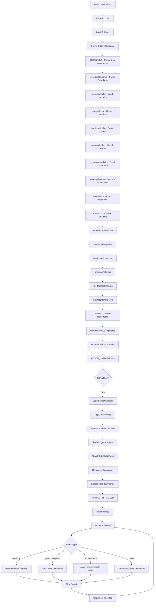

# BLU Initialization Flow

## 🚀 Startup Sequence Diagram



## 📋 Initialization Checklist

### ✅ Core Systems (Always Loaded)
- [x] **BLU Namespace**: Global addon table created
- [x] **Event System**: Custom event dispatcher ready
- [x] **Database**: SavedVariables handler initialized
- [x] **Config**: Default settings loaded
- [x] **Registry**: Sound mappings available
- [x] **Loader**: Module discovery complete
- [x] **Commands**: Slash handlers registered

### 🔌 Conditional Loading
- [ ] **Modules**: Only if enabled in config
- [ ] **Sound Packs**: On first sound play
- [ ] **UI Panels**: On first `/blu` command
- [ ] **Localization**: Additional languages on demand

## 🎮 Event Flow Examples

### Example 1: Player Levels Up
```
1. PLAYER_LEVEL_UP event fires
2. levelup module receives event
3. Module checks if enabled
4. Queries registry for user's selected sound
5. Calls PlaySoundFile() with volume setting
6. Optional: Shows visual notification
7. Logs to debug if enabled
```

### Example 2: User Opens Settings
```
1. Player types /blu
2. Command handler triggered
3. Checks if panels created
4. If not, builds UI dynamically
5. Shows main window with tabs
6. Loads current config into UI
7. Ready for user interaction
```

### Example 3: Module Hot-Reload
```
1. User toggles module in settings
2. If disabling:
   - Call module:Cleanup()
   - Unregister events
   - Clear module state
3. If enabling:
   - Call module:Init()
   - Register events
   - Load module config
4. Save to SavedVariables
```

## 🔍 Debug Trace Points

Key locations for debugging initialization:

```lua
-- core/init.lua
BLU:Debug("ADDON_LOADED", addonName)

-- core/loader.lua
BLU:Debug("Loading module:", moduleName)

-- modules/[name]/[name].lua
BLU:Debug(moduleName, "initialized")

-- interface/settings.lua
BLU:Debug("Settings panel created")
```

## ⚡ Performance Timing

Typical load times on modern hardware:

| Phase | Time | Description |
|-------|------|-------------|
| Core Bootstrap | ~10ms | Framework setup |
| Component Load | ~20ms | UI and localization |
| Module Registration | ~5ms | Discovery only |
| ADDON_LOADED | ~15ms | Config and activation |
| PLAYER_LOGIN | ~10ms | Final initialization |
| **Total** | **~60ms** | Full startup |

## 🛠️ Troubleshooting Init Issues

### Addon doesn't load
1. Check BLU.toc Interface version
2. Verify file paths are lowercase
3. Check for Lua errors in BugSack

### Modules not activating
1. Check SavedVariables for corruption
2. Verify module files exist
3. Enable debug mode: `/blu debug`

### Sounds not playing
1. Check sound files exist in media/sounds/
2. Verify registry mappings
3. Test with: `/blu test levelup`

### UI not showing
1. Check if panels are created
2. Verify interface files loaded
3. Try: `/reload` to reset

## 🔄 Reload Sequence

When user does `/reload`:

1. **Cleanup Phase**
   - All modules call :Cleanup()
   - Events unregistered
   - Hooks removed

2. **Save Phase**
   - Current config written to SavedVariables
   - Profile data persisted

3. **Restart Phase**
   - Full initialization sequence runs
   - Previous state restored from SavedVars

---

*This initialization flow ensures minimal load time while maintaining flexibility for dynamic module loading and configuration changes.*